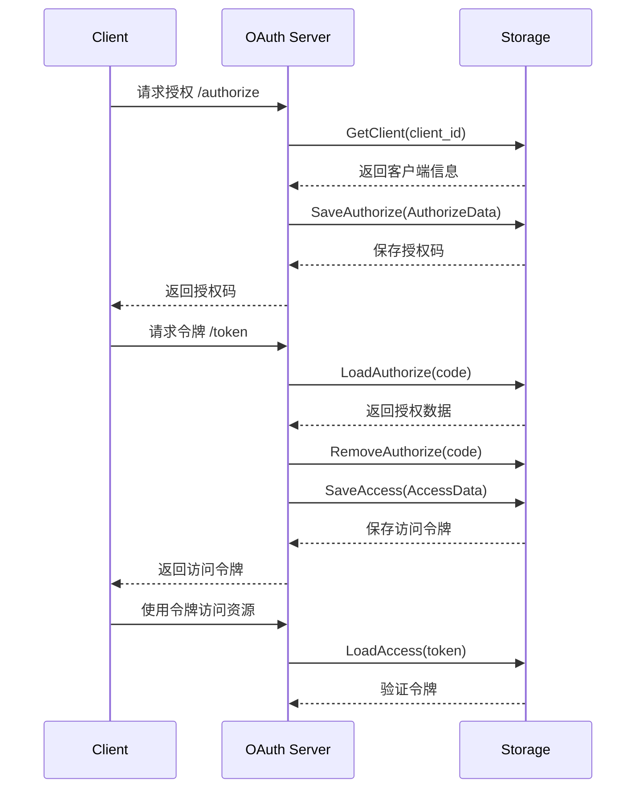
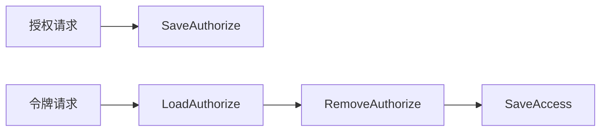
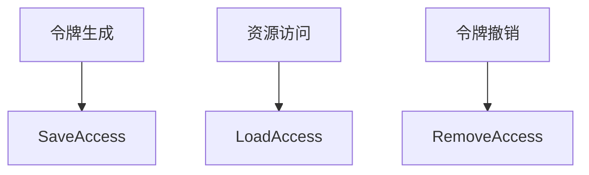
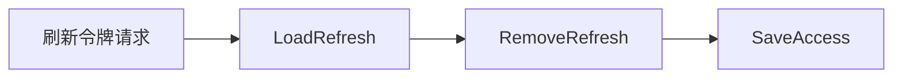
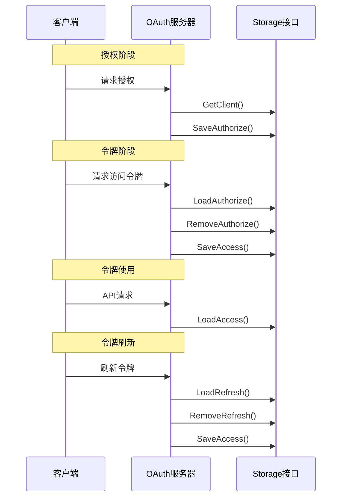

好的，我来解释 osin Storage 接口中各个方法在 OAuth2 流程中的作用。

## 1. 基础方法

```go
Clone() Storage   // 克隆存储实例，用于处理并发访问
Close()          // 关闭存储连接，释放资源
```

这两个方法主要用于资源管理，特别是在使用数据库连接时。

## 2. 核心方法与 OAuth2 流程

让我们通过一个流程图来说明这些方法在 OAuth2 授权码模式中的位置：



### 2.1 客户端管理
```go
GetClient(id string) (Client, error)
```
- **用途**：验证客户端身份
- **时机**：在授权请求和令牌请求开始时
- **作用**：确保请求来自已注册的合法客户端

### 2.2 授权码管理
```go
SaveAuthorize(*AuthorizeData) error
LoadAuthorize(code string) (*AuthorizeData, error)
RemoveAuthorize(code string) error
```

这组方法用于处理授权码的生命周期：



- **SaveAuthorize**: 保存授权码数据
- **LoadAuthorize**: 验证授权码并获取相关信息
- **RemoveAuthorize**: 确保授权码只使用一次

### 2.3 访问令牌管理
```go
SaveAccess(*AccessData) error
LoadAccess(token string) (*AccessData, error)
RemoveAccess(token string) error
```

访问令牌的生命周期管理：



### 2.4 刷新令牌管理
```go
LoadRefresh(token string) (*AccessData, error)
RemoveRefresh(token string) error
```

刷新令牌的处理流程：



## 3. 方法调用时序

在完整的 OAuth2 流程中，这些方法的调用顺序如下：



## 4. 关键注意点

1. **原子性**：
   - SaveAuthorize 和 SaveAccess 操作需要保证原子性
   - RemoveAuthorize 和 SaveAccess 通常需要在同一事务中执行

2. **安全性**：
   - 所有存储的令牌数据应该加密
   - 实现适当的过期机制

3. **性能考虑**：
   - LoadAccess 方法会频繁调用，应考虑缓存
   - Clone 方法对并发性能很重要

4. **数据一致性**：
   - 确保授权码只能使用一次
   - 正确处理令牌过期
   - 维护刷新令牌与访问令牌的关联

根据 [openshift/osin](https://github.com/openshift/osin) 的文档，这个库完整实现了 OAuth2 规范，包括授权码、隐式授权、资源所有者密码凭证和客户端凭证等授权类型。Storage 接口的这些方法正是支持这些授权类型所必需的基础设施。
