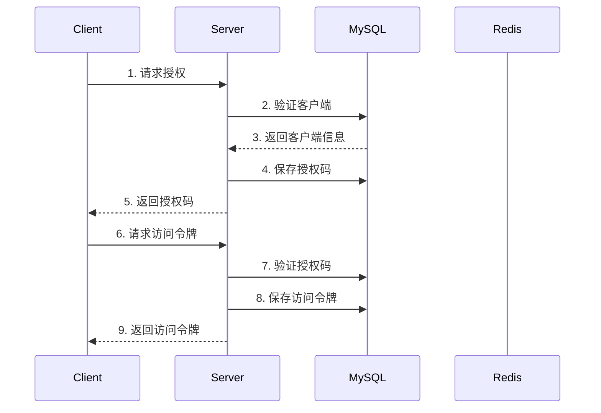

# OAuth2 MySQL Storage Implementation

## 项目简介
这个项目是基于 [github.com/openshift/osin](https://github.com/openshift/osin) 的 OAuth2 服务器实现，主要提供了完整的 MySQL 存储层实现。项目采用领域驱动设计（DDD）架构，实现了标准的 OAuth2 授权流程。

## 技术栈
- Go 1.22+
- MySQL
- Redis (用于缓存)
- go-zero 框架

## 项目结构
```
.
├── application/        # 应用服务层，包含业务逻辑
├── domain/            # 领域层，包含核心业务模型
├── infrastructure/    # 基础设施层，包含数据库实现
│   ├── config/       # 配置
│   └── svc/         # 服务上下文
├── interfaces/        # 接口层，包含 API 处理器
└── cmd/              # 应用程序入口
```

## OAuth2 存储接口说明

### Osin Storage 接口方法说明

1. `Clone() Storage`
   - 作用：创建存储接口的克隆实例
   - 时机：服务初始化时

2. `GetClient(id string) (Client, error)`
   - 作用：获取 OAuth2 客户端信息
   - 时机：客户端认证阶段

3. `SaveAuthorize(data *AuthorizeData) error`
   - 作用：保存授权码信息
   - 时机：授权码授权流程中，生成授权码后

4. `LoadAuthorize(code string) (*AuthorizeData, error)`
   - 作用：加载授权码信息
   - 时机：客户端使用授权码换取访问令牌时

5. `RemoveAuthorize(code string) error`
   - 作用：移除授权码
   - 时机：授权码使用后

6. `SaveAccess(data *AccessData) error`
   - 作用：保存访问令牌信息
   - 时机：生成新的访问令牌时

7. `LoadAccess(token string) (*AccessData, error)`
   - 作用：加载访问令牌信息
   - 时机：验证访问令牌时

8. `RemoveAccess(token string) error`
   - 作用：移除访问令牌
   - 时机：令牌过期或撤销时

9. `LoadRefresh(token string) (*AccessData, error)`
   - 作用：加载刷新令牌信息
   - 时机：使用刷新令牌更新访问令牌时

10. `RemoveRefresh(token string) error`
    - 作用：移除刷新令牌
    - 时机：刷新令牌使用后或过期时

## MySQL Storage 实现原理

我们的 MySQL 存储实现采用以下策略：

1. **表结构设计**：
   - oauth_clients: 客户端信息表
   - oauth_authorize: 授权码信息表
   - oauth_access: 访问令牌表
   - oauth_refresh: 刷新令牌表

2. **缓存策略**：
   - 使用 Redis 缓存频繁访问的数据
   - 采用 write-through 策略确保数据一致性

3. **并发处理**：
   - 使用数据库事务确保数据一致性
   - 实现乐观锁避免并发冲突

## 核心流程

### 授权码流程



## API 接口

### 1. 授权端点
```
GET /oauth2/authorize
```

### 2. 令牌端点
```
POST /oauth2/token
```

### 3. 用户信息端点
```
GET /oauth2/userinfo
```

### 4. 客户端管理接口
```
POST /oauth2/clients    # 创建客户端
GET /oauth2/clients     # 获取客户端列表
DELETE /oauth2/clients  # 删除客户端
```

## 配置说明

```yaml
DB:
  DataSource: "root:password@tcp(localhost:3306)/oauth2?charset=utf8mb4&parseTime=true"

Redis:
  Host: "localhost:6379"
  Pass: ""
  Type: "node"
  Tls: false

Domain: "http://localhost:8080"
```

## 快速开始

1. 克隆项目
```bash
git clone https://github.com/yourusername/oauth2.git
```

2. 配置环境
```bash
cp etc/config.yaml.example etc/config.yaml
# 编辑配置文件
```

3. 运行服务
```bash
make run
```

## Docker 部署

使用 Docker Compose 快速部署：

```bash
docker-compose up -d
```

## 许可证

MIT License 